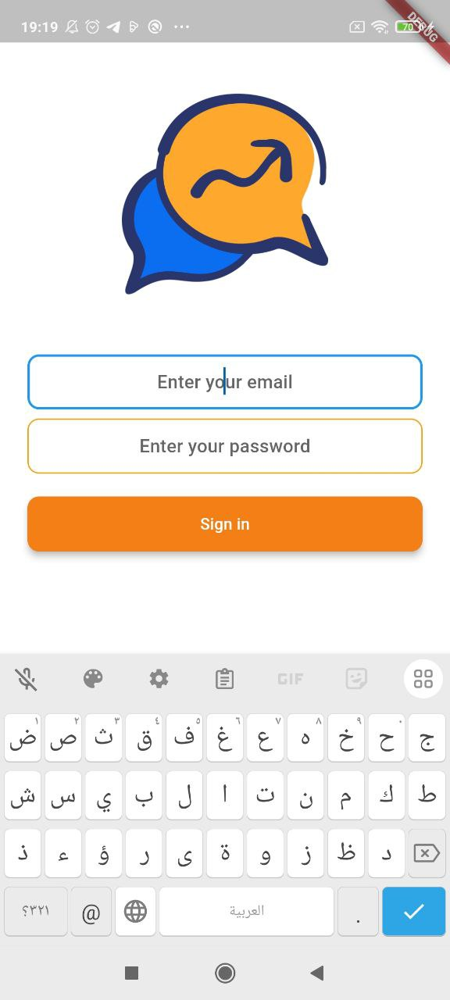
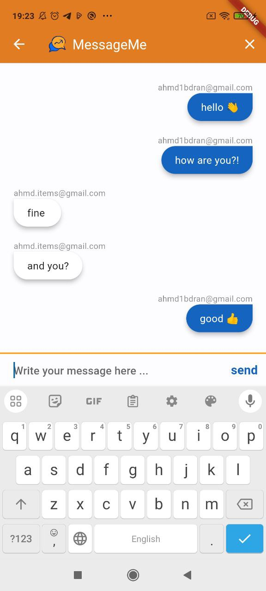

# msg_app

Flutter Firebase Messaging App
Welcome to the Flutter Firebase Messaging App repository! This simple messaging app is built using Flutter for the frontend and Firebase for the backend. Users can register using their email and password, and then engage in messaging with other users.

